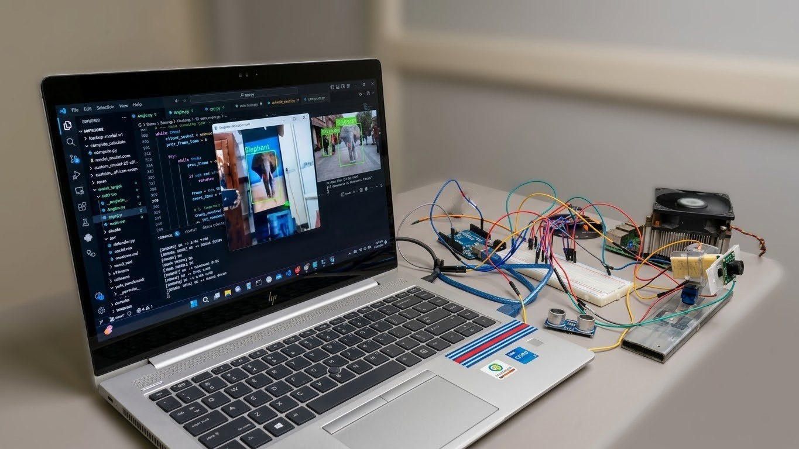
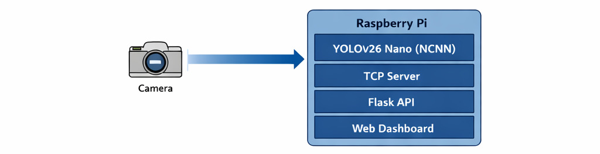
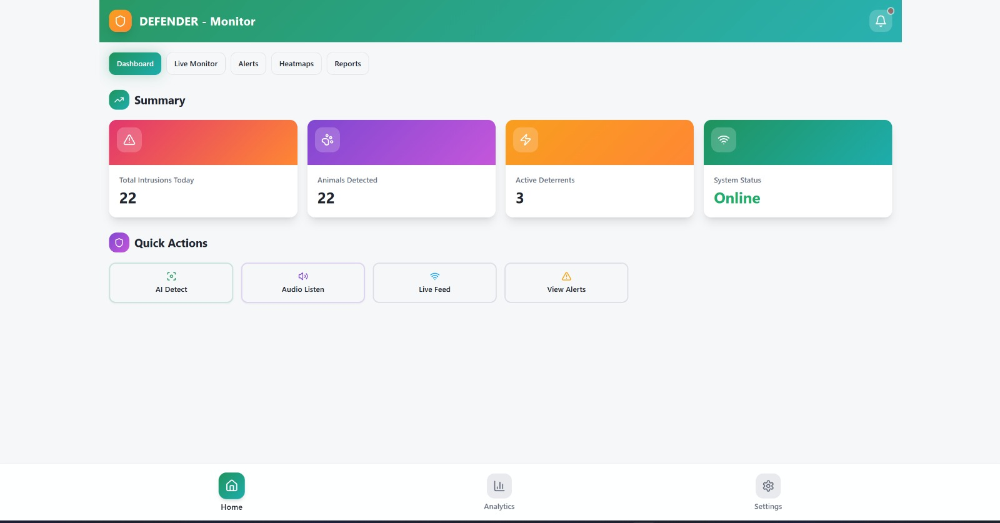

# DEFENDER 🚀

  

### Intelligent Multi-Sensory Animal Intrusion and Prevention System for Farms

  

---

## 🌱 Overview

DEFENDER is an **AI-powered edge-based surveillance system** designed to detect wildlife intrusion in agricultural environments in real time.
It integrates **computer vision, embedded systems, and web technologies** to provide a reliable, cost-effective, and scalable solution for crop protection.

Unlike traditional surveillance systems that rely on manual monitoring or basic motion detection, DEFENDER performs **intelligent object detection directly on edge devices**, enabling faster response and reduced dependency on human intervention.

---

## 🎯 Problem Statement

Wildlife intrusion into farmlands leads to:

* Significant crop damage 🌾
* Economic loss 💸
* Human-wildlife conflict ⚠️

Existing systems:

* Depend heavily on manual monitoring
* Generate false alarms
* Lack real-time intelligence

DEFENDER solves this through **AI-based automated detection and alerting**.

---

## 🎯 Objectives

* Real-time wildlife detection using AI
* Minimize human dependency
* Generate instant alerts and notifications
* Enable remote monitoring via web dashboard
* Ensure low-cost and scalable deployment

---

## 🧠 System Architecture

  

The system follows an **edge-AI architecture**:

* 📷 Camera captures real-time frames
* 🧠 Raspberry Pi processes frames using AI model
* ⚡ Detection happens locally (low latency)
* 🌐 Results are sent to web dashboard
* 🗄️ Events are logged for analysis

---

## 🔄 Detection Workflow

  

1. Image capture from field
2. Preprocessing using OpenCV
3. AI inference using YOLOv26 Nano
4. Object detection with bounding boxes
5. Alert generation
6. Event logging in database
7. Dashboard update in real-time

---

## 🧪 Prototype Implementation

  

The prototype integrates:

* Raspberry Pi 4 (Edge AI Node)
* Camera module
* Servo-based pan-tilt tracking
* Local processing + web monitoring

---

## 📊 Monitoring Dashboard

  

The web dashboard provides:

* 📡 Live monitoring
* 🚨 Real-time alerts
* 📈 Detection history
* 📊 System status visualization

---

## ⚙️ Key Features

* 🧠 AI-based animal detection (YOLOv26 Nano)
* ⚡ Real-time edge processing (no cloud dependency)
* 🌐 Web-based monitoring dashboard
* 📊 Event logging and analytics
* 🎯 Automatic pan-tilt tracking system
* 💡 Low-cost, scalable architecture

---

## 🧩 System Modules

* 📷 Image Capture Module
* 🤖 AI Detection Module
* 🚨 Alert & Notification Module
* 🌐 Web Dashboard
* 🗄️ Database & Logging Module

---

## 🛠️ Technology Stack

### 💻 Hardware

* Raspberry Pi 4
* Camera Module
* Arduino (for control systems)
* Servo Motors (Pan-Tilt Mechanism)

### 🧪 Software

* Python & C++
* OpenCV
* YOLOv26 Nano (Deep Learning Model)
* NCNN (Inference Engine)
* Flask (Backend API)
* React.js (Frontend Dashboard)
* SQLite / MongoDB (Database)

---

## 🧱 System Design Highlights

* Edge-based processing → reduces latency
* Modular architecture → easy scalability
* Lightweight AI model → runs on CPU
* Real-time communication → instant alerts

---

## 🌍 Applications

* 🌾 Agricultural field protection
* 🌲 Forest and wildlife monitoring
* 🏙️ Smart city surveillance
* 🛡️ Border and restricted area security

---

## 👥 Team

* Swarag V S
* Narthana Baby B S
* Meenakshi Pramod
* Meenakshi M Kumar

---

## 🚀 Future Scope

* Multi-camera integration
* Mobile application for alerts
* Cloud synchronization
* Advanced analytics & heatmaps
* Drone-based monitoring systems

---

## 📌 About

This project is developed as part of a **B.Tech Major Project** at
**Cochin University of Science and Technology (CUSAT)**.

---

## ⭐ Organization Structure

This organization contains multiple repositories representing different modules:

* Backend / Core System
* Web Dashboard
* Mobile Application
* Supporting Components

---

  <b>DEFENDER — Intelligent Protection through Edge AI</b>

